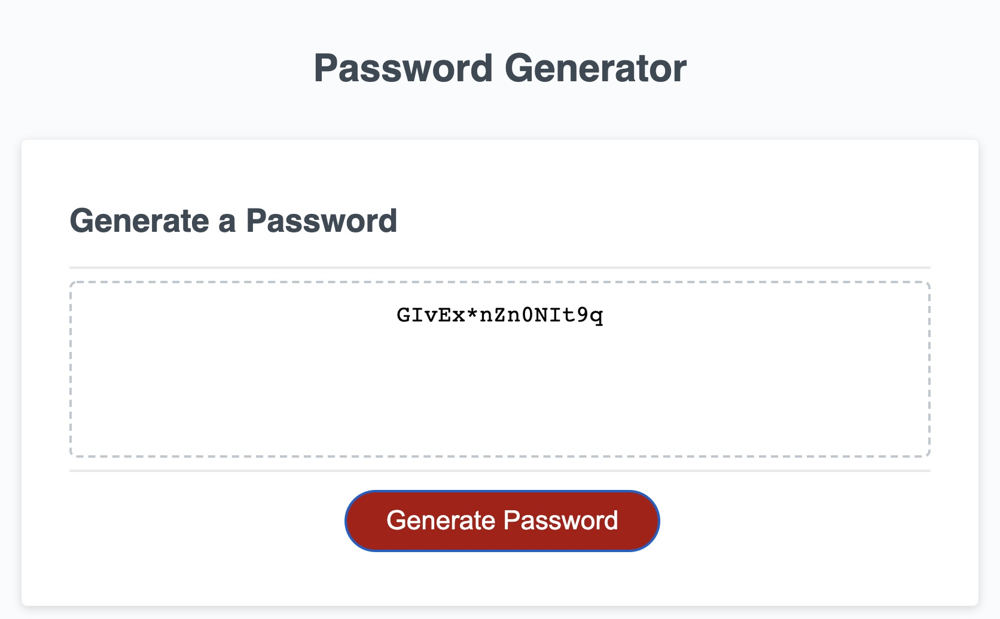

# Refactor for Password Generator:

  https://mrsumada.github.io/password-generator/

  - Prompts user for which Criteria to specify.
  
  - Requires a Password Length between 8 and 128.
  
  - Validates each Criteria specification.

  - Includes default values for skipped Criteria selections.

  - Creates array from characters included in Character Type specifications.

  - Loops randomly picked characters from array to generate final password.
  
  - Writes password with all criteria to textarea.

  
